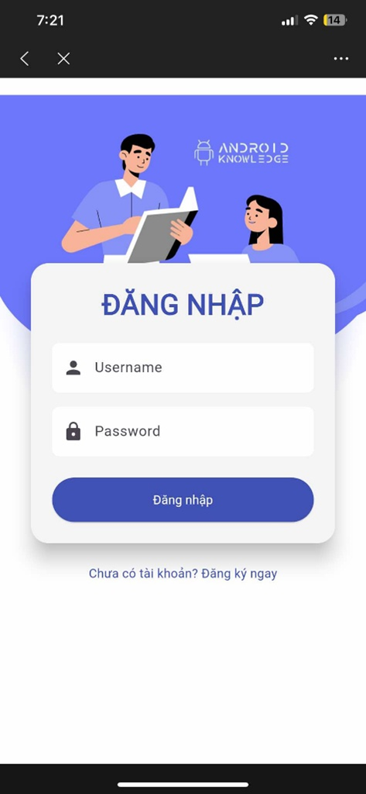
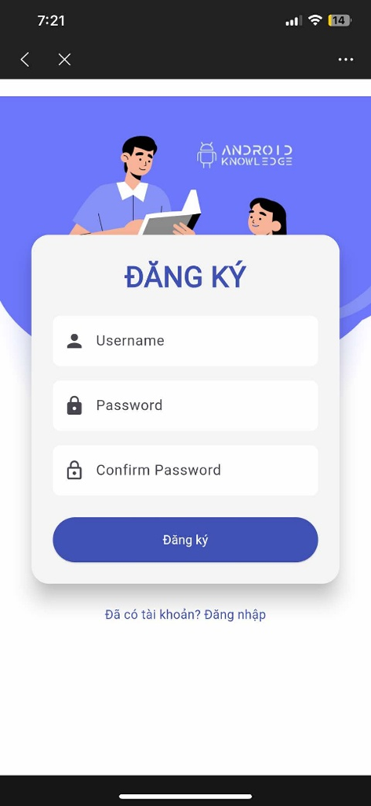

# GPS IoT Flutter

A cross-platform Flutter application for real-time GPS tracking and IoT device management, designed for educational and practical IoT scenarios.

## Features

- **User Authentication:** Register and log in to your account.
- **Device Management:** View and manage IoT devices.
- **Real-Time Location Tracking:** Track device locations on Google Maps.
- **Firebase Integration:** Uses Firebase Realtime Database for device and location data.
- **Cross-Platform:** Supports Android, iOS, Web, Windows, Linux, and macOS.

## Main Pages

- **LoginPage:** User authentication interface.
- **RegisterPage:** New user registration.
- **HomePage:** Dashboard for device overview and navigation.
- **TrackingLocationPage:** Real-time map view of device locations.

## Core Components

- **DeviceIoT Model:** Represents IoT device data.
- **LocationService:** Handles location retrieval and updates.
- **BLoC Pattern:** Manages device state and events for scalable state management.

## Getting Started

### Prerequisites

- [Flutter SDK](https://flutter.dev/docs/get-started/install)
- Firebase project with Realtime Database enabled
- Google Maps API key (for map features)

### Installation

1. Clone this repository.
2. Run `flutter pub get` to install dependencies.
3. Add your `google-services.json` (Android) and configure Firebase for iOS/Web as needed.
4. Run the app:
   - Android/iOS: `flutter run`
   - Web: `flutter run -d chrome`
   - Desktop: `flutter run -d windows` (or `macos`/`linux`)

### Folder Structure

- `lib/`
  - `bloc/` – State management (BLoC)
  - `model/` – Data models
  - `page/` – UI pages/screens
  - `service/` – Service classes (e.g., location)
  - `widgets/` – Reusable UI components

## Dependencies

- `google_maps_flutter` – Map integration
- `firebase_core`, `firebase_database` – Firebase backend
- `location`, `geolocator` – Device location services
- `shared_preferences` – Local storage

## License

This project is for educational purposes.

---

For more details, see the source code and comments in each file.

## Reference Images

Below are screenshots and hardware photos for reference:

**Login Screen**

**Register Screen**

**Add Device Dialog**

**Device List and Location**

**Tracking on Map**

**Hardware Setup (ESP8266 + GPS Module)**

